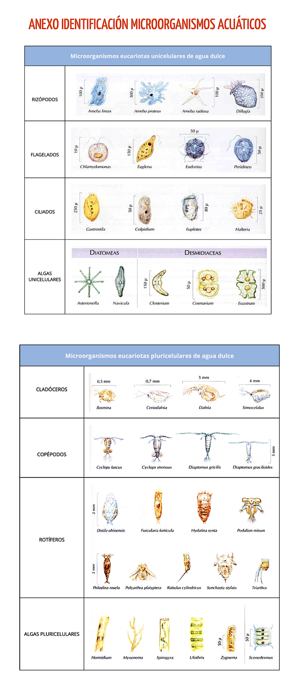

- **Archivo previsto:** `../assets/P03/04_proceso_centrifugacion.jpg`
- **Texto alternativo:** Tubo y centrífuga durante la preparación concentrada.
- **Pie de foto:** [Indica el equipo y los parámetros validados por el centro; fotografía solo si está permitido y sin datos identificativos.]
- **Control de seguridad o calidad visible:** [Completa]
- **Autoría:** [Propia / compartida con tu pareja]
- **Modalidad no realizada:** [Escribe «No aplica» y explica el motivo, si no se realizó centrifugación.]
- **Imagen del alumnado:** [Añadir aquí después de la práctica.]

### Imagen 5 — Campo microscópico teñido con centrifugación

- **Archivo previsto:** `../assets/P03/05_campo_tenido_con_centrifugacion.jpg`
- **Texto alternativo:** Campo microscópico de la preparación teñida tras centrifugación.
- **Pie de foto:** [Describe el campo, identifica la fracción observada y registra el aumento.]
- **Rasgo observado y limitación:** [Completa; no infieras movilidad ni viabilidad tras la concentración.]
- **Autoría:** [Propia / compartida con tu pareja]
- **Modalidad no realizada:** [Escribe «No aplica» y explica el motivo, si no se realizó esta preparación.]
- **Imagen del alumnado:** [Añadir aquí después de la práctica.]

## 12. Incidencias, errores y medidas correctoras [ALUMNADO · RELLENABLE · DURANTE]

| Incidencia, error o duda detectada | Posible causa | Medida correctora aplicada o propuesta | ¿Afectó al resultado? |
|---|---|---|---|
| [Completa o escribe “No se detectaron incidencias”] | [Completa] | [Completa] | [Sí / No; explica] |

## 13. Interpretación técnica [ALUMNADO · RELLENABLE · DESPUÉS]

Interpreta los resultados de la tinción usando los controles de calidad, las observaciones y la comparación con P02. Explica qué información se hizo más visible, qué posible artefacto o limitación introdujo el colorante y por qué la tinción no permite por sí sola una identificación definitiva.

[Escribe aquí tu interpretación técnica.]

## 14. Conclusión [ALUMNADO · RELLENABLE · DESPUÉS]

Indica si alcanzaste el objetivo de preparar, observar y comparar la tinción vital directa con azul de metileno. Si realizaste la ruta centrifugada, describe por separado la preparación concentrada y teñida, y menciona sus límites. Sustenta tu conclusión con evidencias concretas.

[Escribe aquí tu conclusión.]

## 15. Reflexión profesional [ALUMNADO · RELLENABLE · DESPUÉS]

Responde de forma razonada a las cuatro preguntas. Relaciona cada respuesta con datos, observaciones o imágenes incluidas en tu cuaderno.

1. **Procedimiento:** Al preparar o recibir la solución de azul de metileno al 0,5 % p/v, ¿qué comprobaste sobre la pesada, el volumen final de 100 mL, la etiqueta y la FDS? Si no la preparaste, indica quién proporcionó la solución y qué verificaste antes de usarla.

   [Respuesta del alumnado]

2. **Interpretación:** Compara los campos teñidos directo y tras centrifugación (imágenes 3 y 5), si realizaste ambas modalidades. ¿Qué diferencias de contraste o morfología observaste? Contrástalas con el anexo sin convertir la semejanza en una identificación confirmada; no infieras movilidad ni viabilidad tras centrifugar.

   [Respuesta del alumnado]

3. **Conclusiones:** Comparando la misma muestra en fresco en P02 con la preparación teñida directa de P03, ¿qué información aporta cada modalidad y cuál permitió describir mejor los rasgos observados? Si también centrifugaste, explica qué añadió esa preparación y qué limitación tuvo. Sustenta la conclusión con tus evidencias reales.

   [Respuesta del alumnado]

4. **Aprendizaje y transferencia:** ¿En qué situación elegirías observar la muestra sin tinción y sin centrifugar, sin tinción y centrifugada, teñida y sin centrifugar, o teñida y centrifugada? Justifica cada elección según el objetivo de observación y las limitaciones de la muestra; en la preparación centrifugada no infieras movilidad ni viabilidad.

   [Respuesta del alumnado]

## 16. Trazabilidad y entrega [ALUMNADO · RELLENABLE · DESPUÉS]

| Campo | Registro del alumnado |
|---|---|
| Identificador de práctica | `P03` |
| Fecha | [dd/mm/aaaa] |
| UD / RA / CE | `UD2 / RA02 / CE02.a–CE02.g` |
| Agrupamiento | [Individual / pareja; especifica] |
| Modalidad y origen de la muestra o evidencia | [Completa] |
| Reactivo y lote o referencia | [Completa] |
| Controles | [Resume o enlaza al apartado 9.1] |
| Resultado | [Resume o enlaza al apartado 10] |
| Interpretación | [Resume o enlaza al apartado 13] |
| Incidencias y acciones correctoras | [Resume o enlaza al apartado 12] |
| Ruta de residuos aplicada | [Completa] |
| Estado de entrega | [Borrador / pendiente de revisión / entregado / corregido] |

## Referencia técnica

- Sociedad Española de Enfermedades Infecciosas y Microbiología Clínica (SEIMC). *Procedimientos en Microbiología Clínica, n.º 30: Diagnóstico microbiológico de las infecciones gastrointestinales*, 2008, PNT-GE-03. [PDF](https://seimc.org/wp-content/uploads/2025/06/seimc-procedimientomicrobiologia30.pdf) (consultado el 26/09/2026). Referencia de examen parasitológico fecal; no valida la muestra de agua ni la centrifugación docente descrita en esta ficha.

---

## Anexo. Láminas de organismos microscópicos y microfauna de agua dulce

Las láminas reúnen ejemplos de organismos que pueden aparecer en muestras de agua dulce: eucariotas unicelulares —rizópodos, flagelados, ciliados, algas unicelulares y diatomeas— y formas pluricelulares microscópicas o de pequeño tamaño —cladóceros, copépodos, rotíferos y algas pluricelulares—. Los dibujos y nombres sirven para comparar rasgos morfológicos y proponer identificaciones orientativas; la presencia depende de la muestra y no confirma por sí sola lo observado. Las capturas fueron proporcionadas como material docente y no muestran los datos de autoría ni la publicación original.

*Figura. Láminas docentes de consulta morfológica; no son fotografías de la muestra examinada ni permiten confirmar una identificación*